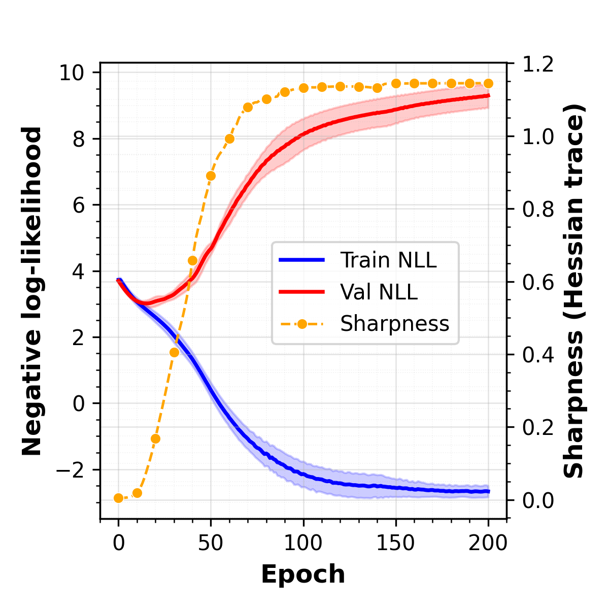
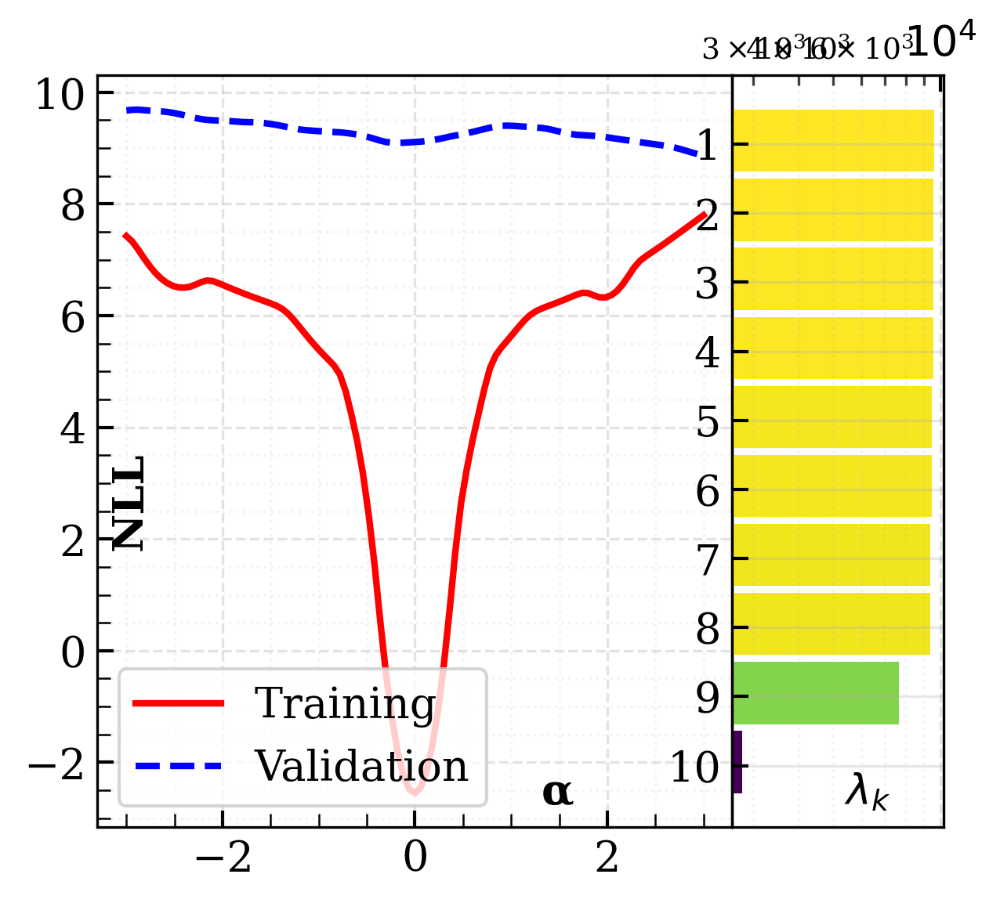
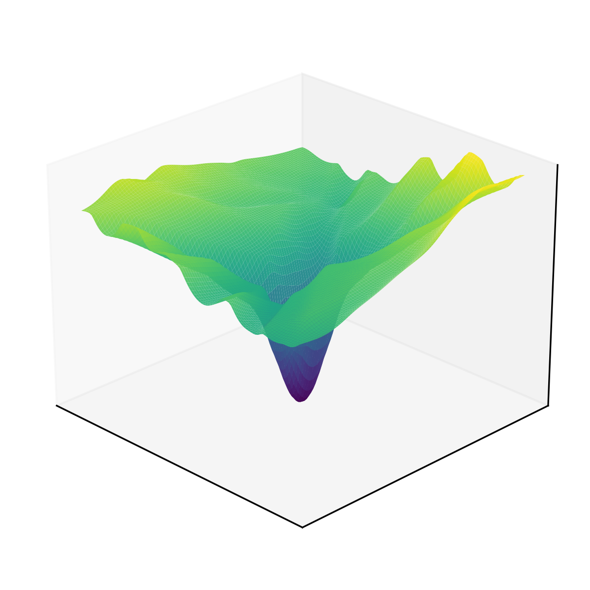
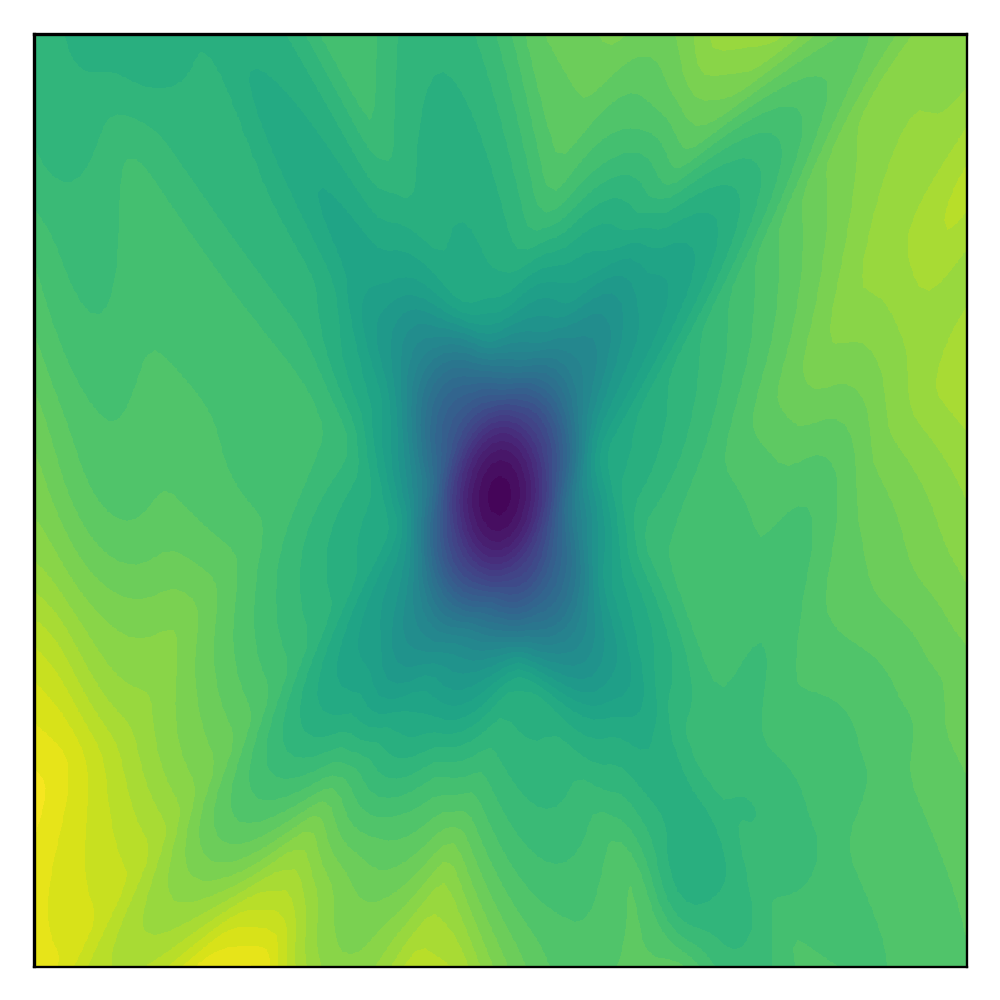
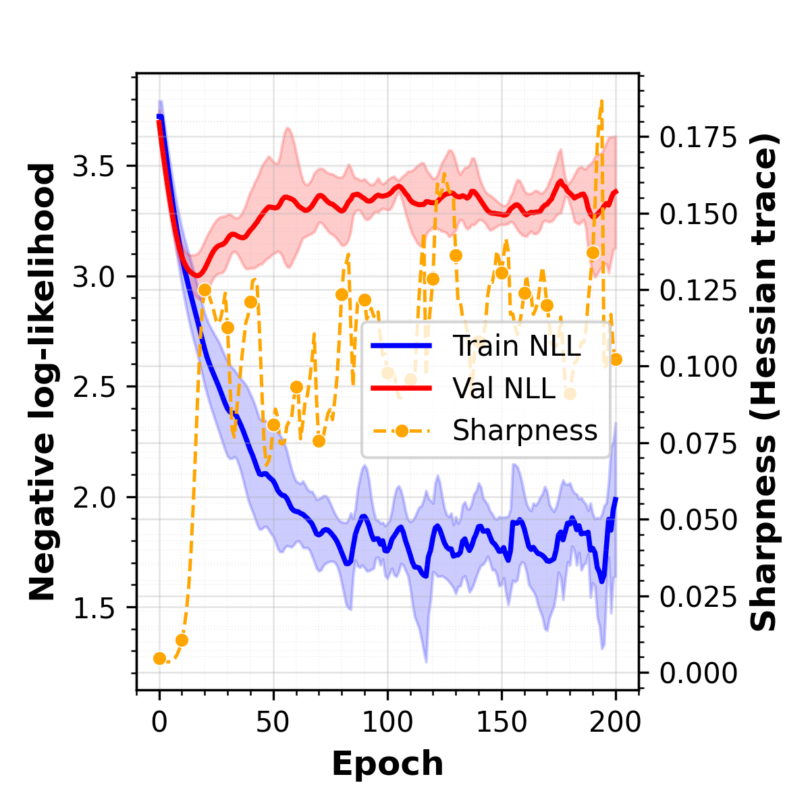
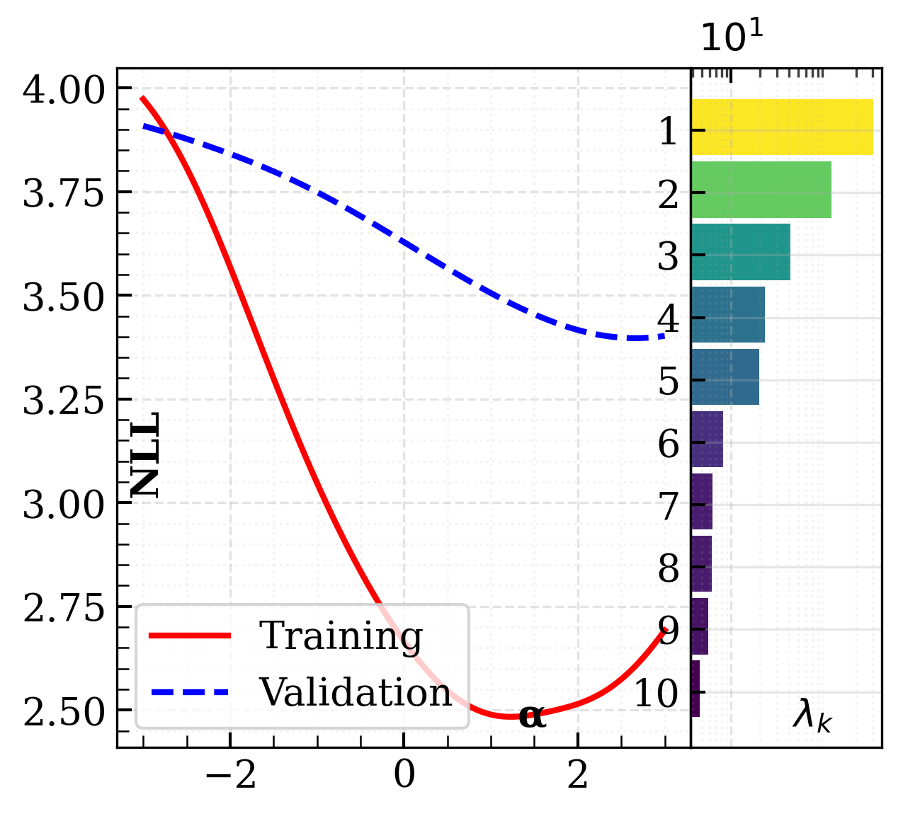
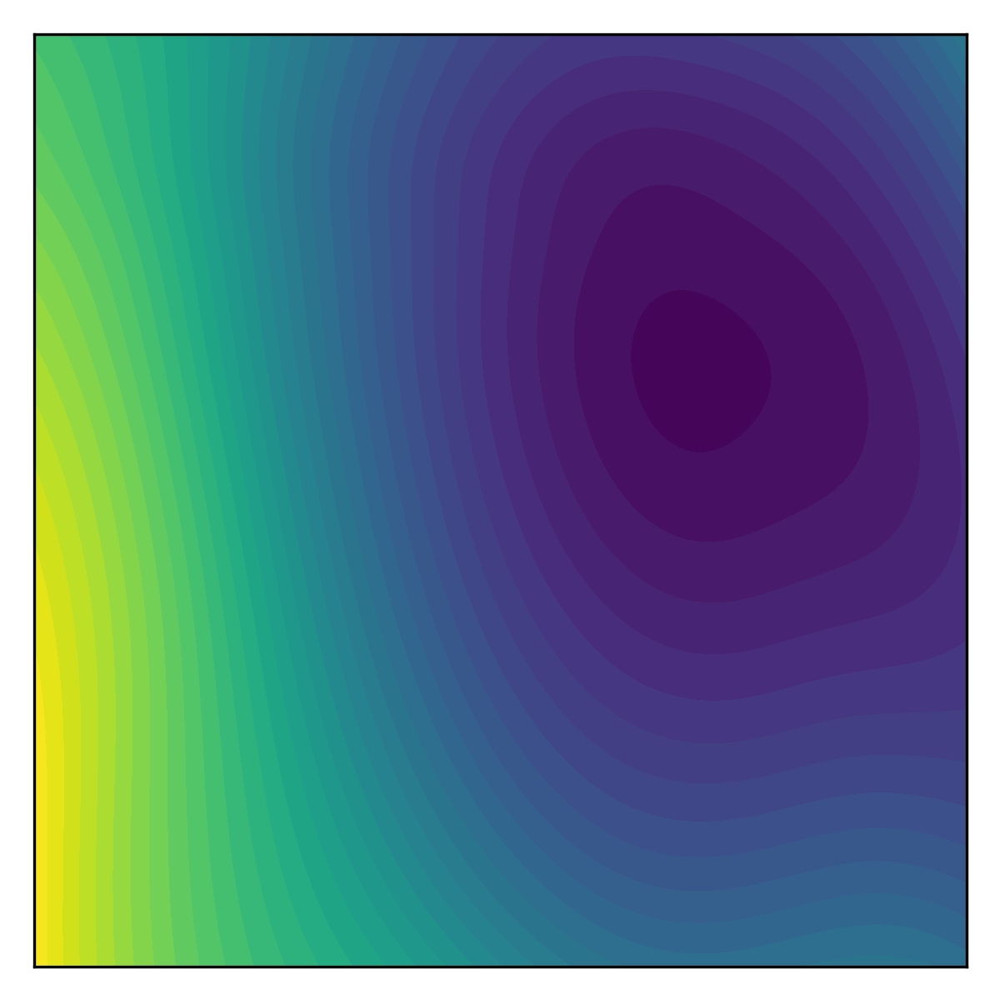

# Tractable Sharpness-Aware Regularization for Probabilistic Circuits

[](#)
[](#)
[](LICENSE)
[](https://arxiv.org/pdf/2508.05537)

Official code for the AAAI-26 paper: *Tractable Sharpness-Aware Learning of Probabilistic Circuits*. We intoroduce a tractable a Hessian-trace penalty that helps probabilistic circuits avoid sharp minima, stabilizing EM and SGD training, improving generalization. We wrap the two major PC stacks (PFC/EinsumNetworks and PyJuice TensorCircuit) and provide with the experiment and plotting scripts from the paper for reproducibility.

## At a glance
Two-moons (EinsumNet, K=10, SGD, n=0.05). First row: no regularization (μ=0). Second row: sharpness-aware (μ=auto).

| Setting → / View ↓ | Learning curve | 1D loss + spectrum | 2D surface | 2D contour |
| --- | --- | --- | --- | --- |
| Unregularized Baseline |  |  |  |  |
| Sharpness Aware Learning |  |  |  |  |

## Installation
Requires Python 3.10+ and a recent PyTorch (CPU or CUDA).

```bash
git clone <repo_url>
cd sharpness-aware-pc
# (venv or conda) optional but recommended
pip install -e .               # installs hessian_reg and vendored backends
pip install -r requirements.txt
```
GPU wheels (optional): `pip install torch torchvision --index-url https://download.pytorch.org/whl/cu121`

Prefer Conda? `environment.yml` mirrors `requirements.txt`; add your own dev extras if needed.


## Project layout
```
assets/             # Figures used in the README
configs/            # Hydra defaults and config notes
hessian_reg/        # Core package: datasets, models, trainer, experiments, utils
packages/           # Vendored PC backends (PFC, PyJuice)
scripts/            # Experiment grids, plotting, data downloaders
tests/              # Pytest suite for datasets/wrappers/Hessian checks
paper.pdf           # Draft of the accompanying paper
pyproject.toml      # Packaging metadata
results/            # Default output root for Hydra runs
```

## Quick start (single runs)
- **2‑D synthetic (spiral) with sharpness regularization**
  ```bash
  
  # Unregularized Baseline (Set trainer.mu=0)
  python -m hessian_reg.run \
    dataset.name=spiral dataset.n_samples=0.1 \
    model.backend=pfc model.model_name=EinsumNet model.num_vars=2 \
    model.leaf_distribution=NormalArray model.num_sums=10 \
    model.num_input_distributions=10 model.graph_type=ratspn \
    +model.num_repetitions=10 +model.leaf_config.mean=0 +model.leaf_config.std=1 \
    trainer.mode=sgd trainer.mu=0 trainer.lambda_=1.0 trainer.lr=3e-3 trainer.save_final=True\
    seed=0 

  # Sharpness-Aware Learning (Set trainer.mu to any float value to see corresponding effect.)
  python -m hessian_reg.run \
    dataset.name=spiral dataset.n_samples=0.1 \
    model.backend=pfc model.model_name=EinsumNet model.num_vars=2 \
    model.leaf_distribution=NormalArray model.num_sums=10 \
    model.num_input_distributions=10 model.graph_type=ratspn \
    +model.num_repetitions=10 +model.leaf_config.mean=0 +model.leaf_config.std=1 \
    trainer.mode=sgd trainer.mu=auto trainer.lambda_=1.0 trainer.lr=3e-3 trainer.save_final=True\
    seed=0 
  ```

Outputs default to `results/<dataset>/<backend>/<model>_<mode>/R<mu>` (Hydra’s `run.dir`).

## Experiments and scripts
- **Example Individual Runs**: `bash scripts/run_sample_experiments.sh` provides both EinsumNet and PyJuice sample templates for running experiments.
- **Grid runs**: `bash scripts/runall_einsum_experiments.sh` and `bash scripts/runall_pyjuice_experiments.sh` mirror the paper sweeps.
- **Loss landscapes**: `bash scripts/visualize_loss_surface.sh` renders 2‑D/3‑D surfaces for sharpness comparisons.
- **Learning curves**: `bash scripts/plot_learning_curves.sh` aggregates results.
- **Data**: `python scripts/download_debd.py` pulls the DEBD datasets (pinned commit).

## Configuration
Hydra drives everything via `configs/main.yaml`:
- `model.*` – backend (`pfc`, `pyjuice`), structure (`EinsumNet`, `TensorCircuit`, graph type, leaf distributions).
- `trainer.*` – optimisation mode (`sgd`, `em`), learning rate, Hessian strength `mu` (scalar or schedule name), `lambda_`, epochs, and save options.
- `dataset.*` – dataset name (`spiral`, `two_moons`, `pinwheel`, `helix`, `nltcs`, …), batch size, and sampling fraction.
- `exp.*` – run naming and base directory (`results` by default; override with `exp.base_dir` or `RESULTS_DIR`).

Override from the CLI:
```bash
python -m hessian_reg.run \
  dataset.name=two_moons dataset.n_samples=0.1 \
  model.backend=pfc model.model_name=EinsumNet \
  trainer.mode=sgd trainer.mu=auto trainer.lr=5e-3 \
  exp.base_dir=/tmp/pc-hessian
```

## Outputs and logging
- Hydra writes each run to the configured `hydra.run.dir` (default under `results/...`).
- A lightweight `report.md` with the final NLL is saved in the run directory.
- Enable Weights & Biases by passing `wandb_project=<project_name>` to `hessian_reg.run`.

## Testing
```bash
cd tests
pytest -q
```
Tests auto-select CUDA if available and skip GPU-only paths otherwise.

## Citing
If you use this codebase, please cite the accompanying paper.
BibTeX:

```bibtex
@inproceedings{suresh2026tractable,
  title     = {Tractable Sharpness-Aware Learning of Probabilistic Circuits},
  author    = {Suresh, Hrithik and Sidheekh, Sahil and Shreeram M.P, Vishnu and Natarajan, Sriraam and Krishnan, Narayanan C.},
  booktitle = {Proceedings of the 40th AAAI Conference on Artificial Intelligence},
  year      = {2026}
}
```
